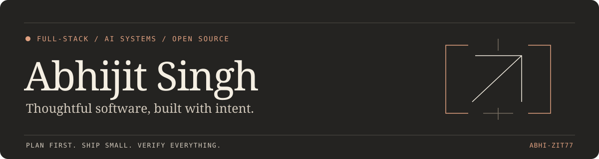

  
  
  
  

# Software with purpose. Details that matter.

I'm **Abhijit Singh**. I build websites, web and mobile apps, developer tools, and practical AI systems. My work brings together considered interfaces, reliable backend behavior, and careful validation.

Recently, I've been working on client fintech products, interactive web experiences, reusable skills for coding agents, and open-source runtime reliability. I use AI throughout development, with architecture, code review, and testing as part of the process.

**Open to freelance projects and open-source collaboration.**

## Selected projects

### [Strix Framewok](https://github.com/abhi-zit77/Strix-s-framework)

Portable security-assessment workflows for **Claude Code and Codex**, adapted from [Strix](https://github.com/usestrix/strix) with attribution. Packages threat modeling, evidence-backed findings, coverage tracking, and fix verification into an installable skill and plugin.

`Agent skills` · `Security workflows` · `Python` · `Cross-platform validation`

### [TerminalTalk](https://github.com/abhi-zit77/TerminalTalk)

A realtime terminal chat app built with **TypeScript, Ink, React, and Convex**. Includes group chats, friend requests, direct messages, themes, and terminal-session-based message disappearance. Available as [`@abhi_zit/terminaltalk`](https://www.npmjs.com/package/@abhi_zit/terminaltalk); currently early testing software.

`CLI / TUI` · `Realtime systems` · `TypeScript` · `Convex`

### Recent product and web work

- **BillFirst — client work:** building an Expo / React Native mobile MVP and a separate Next.js landing page and waitlist, with Supabase-backed flows and a focus on correctness and QA.
- **AI Foundry 101 — website build:** a notebook-inspired AI-learning experience connecting practical demos, learning topics, and a Whop membership route. Designed around a progression from beginners to builders.
- **Abhizit — personal portfolio:** an interactive Next.js portfolio with scroll-led storytelling, responsive layouts, reduced-motion support, and a Cal.com booking flow. [Visit my portfolio](https://abhizit-portfolio.vercel.app/).

## Open source

I contribute focused fixes with reproducible evidence, targeted tests, and clear review notes.

### Merged into [Open Design](https://github.com/nexu-io/open-design)

| Contribution | What changed |
| :--- | :--- |
| [Folder-picker error handling · #4812](https://github.com/nexu-io/open-design/pull/4812) | Surfaced native picker failures instead of silently treating them as cancellation. |
| [Agent output validation · #4835](https://github.com/nexu-io/open-design/pull/4835) | Prevented tool-only and reasoning-only runs from being reported as successful empty responses. |
| [Container release verification · #5016](https://github.com/nexu-io/open-design/pull/5016) | Added anonymous GHCR pull verification and OCI source metadata to the release workflow. |

### Open pull requests

| Project | Contribution |
| :--- | :--- |
| Open Design | [Letta Code integration through ACP · #6340](https://github.com/nexu-io/open-design/pull/6340) |
| Open Design | [Verified Windows process-tree cancellation · #6379](https://github.com/nexu-io/open-design/pull/6379) |
| Open Design | [macOS private IPC socket-path fix · #8002](https://github.com/nexu-io/open-design/pull/8002) |
| Claude Code | [Plugin marketplace installation docs · #70066](https://github.com/anthropics/claude-code/pull/70066) |
| Public APIs | [GitHub Actions link checking · #772](https://github.com/n0shake/Public-APIs/pull/772) |

PR states checked on September 27, 2026. Each link shows the latest status.

Earlier contribution work

Submitted focused patches to **TheAlgorithms/Python** for [3×3 matrix inversion](https://github.com/TheAlgorithms/Python/pull/14840), [pancake-sort type hints](https://github.com/TheAlgorithms/Python/pull/14841), and [bubble-sort complexity notes](https://github.com/TheAlgorithms/Python/pull/14842), plus **freeCodeCamp** [navigation accessibility](https://github.com/freeCodeCamp/freeCodeCamp/pull/67937), [signout behavior](https://github.com/freeCodeCamp/freeCodeCamp/pull/67936), and [curriculum wording](https://github.com/freeCodeCamp/freeCodeCamp/pull/67926). These PRs were closed without merging.

## Tools I build with

**Languages**

**Web, mobile, and interfaces**

**Backend and data**

**Development and delivery**

Also in my workflow: **Codex**, **Ink**, **Vitest**, and browser-based validation.

## How I work

Understand the problem. Define a small scope. Build the right thing. Reproduce bugs before fixing them. Check types, behavior, accessibility, and the actual user experience. Keep local validation, deployment, and release status distinct.

**Plan first. Ship small. Verify everything.**

---

  <a href="https://github.com/abhi-zit77?tab=repositories">Repositories</a> &nbsp; / &nbsp;
  <a href="https://github.com/pulls?q=is%3Apr+author%3Aabhi-zit77">Contribution history</a> &nbsp; / &nbsp;
  <a href="https://abhizit-portfolio.vercel.app/">Portfolio</a> &nbsp; / &nbsp;
  <a href="https://www.linkedin.com/in/abhijit-singh-016b53423/">Let's connect</a>

